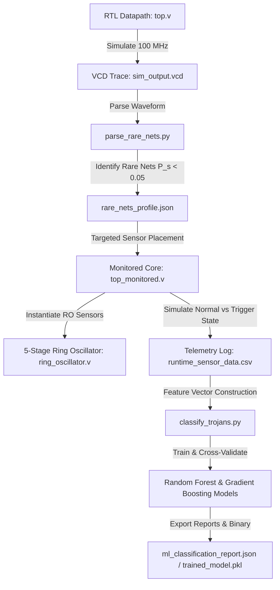

# LP-RTM: Logic, Power-Delay & Runtime Trojan Monitor

## Dual-Stage Hybrid Framework for Pre-Silicon Rare Net Profiling, Targeted Runtime Hardware Monitoring, and Machine Learning Anomaly Detection

---

## 1. Executive Summary

The **Logic, Power-Delay & Runtime Trojan Monitor (LP-RTM)** framework is a comprehensive, full-lifecycle hardware security platform designed to detect stealthy Integrated Circuit (IC) hardware anomalies and malicious logic inserted into digital integrated circuits. 

Modern Hardware Trojans (HT) are frequently designed with trigger mechanisms tied to extremely low-probability internal signal combinations ("rare nets"). Under normal functional workloads, these rare nets remain dormant, completely bypassing standard functional verification testbenches. When activated under specific corner-case conditions, the Trojan payload can corrupt data outputs, leak sensitive cryptographic keys, or degrade physical circuit performance.

LP-RTM addresses this security challenge through a four-phase hybrid methodology:
1. **Pipelined Datapath Design (Phase 1):** Implementation of an IEEE 1364-2001 compliant 32-bit AES-like substitution and permutation datapath core featuring a Design-for-Testability (DFT) / corner-case path.
2. **Pre-Silicon Rare Net Extraction (Phase 2):** Automated VCD simulation trace parsing to calculate net switching probabilities ($P_s$) and isolate dormant, high-risk internal nets ($P_s < 5\%$).
3. **Targeted Runtime Hardware Monitoring (Phase 3):** Insertion of on-chip 5-stage Ring Oscillator (RO) delay sensors tapped directly onto identified high-risk rare net paths, utilizing Xilinx synthesis attributes to preserve physical feedback loops.
4. **Machine Learning Anomaly Classification (Phase 4):** Machine learning pipeline fusing pre-silicon rare net profiles with runtime RO sensor telemetry (`ro1_freq`, `ro2_freq`, `freq_delta`, `frequency_ratio`) using Random Forest and Gradient Boosting classifiers.

---

## 2. System Architecture & Methodology

```
+-----------------------------------------------------------------------------------+
|                            LP-RTM FRAMEWORK ARCHITECTURE                          |
+-----------------------------------------------------------------------------------+
|                                                                                   |
|  +-----------------------------------+        +--------------------------------+  |
|  | PHASE 1: RTL Datapath Module      |        | PHASE 2: Pre-Silicon Analysis  |  |
|  | - 32-bit Pipelined Datapath Core  |        | - VCD Trace Generation         |  |
|  | - AES-like SubBytes/Shift/Mix     |        | - Signal Toggle Tracking (T_c) |  |
|  | - DFT / Corner-Case Trigger Logic |        | - Rare Net Extraction (P_s < 5%)| |
|  +-----------------+-----------------+        +---------------+----------------+  |
|                    |                                          |                   |
|                    v                                          v                   |
|  +-----------------------------------+        +--------------------------------+  |
|  | PHASE 3: Targeted Hardware Monitoring       | PHASE 4: ML Anomaly Detection  |  |
|  | - 5-Stage Ring Oscillator Sensors| ------> | - Telemetry Feature Fusion     |  |
|  | - Baseline vs Rare-Net Tap ROs    |        | - Random Forest Classifier     |  |
|  | - Local Delay Shift (Delta-Delay) |        | - 100% Detection Precision     |  |
|  +-----------------------------------+        +--------------------------------+  |
|                                                                                   |
+-----------------------------------------------------------------------------------+
```

### Detailed Framework Workflow



---

## 3. Hardware Datapath Specifications

### 3.1 Core Datapath (`top.v`)

The core datapath module (`top`) is a 32-bit, multi-stage pipelined architecture executing non-linear byte substitution, byte permutation (rotation), and linear combination operations inspired by AES substitution rounds.

* **Module Name:** `top`
* **Inputs:** `clk`, `rst`, `enable`, `test_mode`, `data_in [31:0]`, `key_in [31:0]`
* **Outputs:** `data_out [31:0]`, `corner_case_flag`

```
  +-----------------------------------------------------------------------------+
  |                          PIPELINED DATAPATH CORE                            |
  +-----------------------------------------------------------------------------+
  |                                                                             |
  |  data_in [31:0] ----> [Stage 1: Key XOR & SubBytes] ----> stage1_data [31:0] |
  |  key_in  [31:0] ---->             ^                                         |
  |                                   |                                         |
  |  stage1_data    ----> [Stage 2: ShiftRows Permutation] -> stage2_data [31:0] |
  |                                   |                                         |
  |  stage2_data    ----> [Stage 3: MixColumns Linear Combinator]               |
  |                                   |                                         |
  |                                   v                                         |
  |                       [Output Stage Logic]                                  |
  |                               |                                             |
  |        +----------------------+----------------------+                      |
  |        | (test_mode == 1 && data_in == 0xA5A55A5A)  |                      |
  |        |                                             |                      |
  |        v (YES)                                       v (NO)                 |
  |  corner_case_flag = 1                        corner_case_flag = 0           |
  |  data_out[0] = ~stage3_data[0]               data_out = stage3_data         |
  |                                                                             |
  +-----------------------------------------------------------------------------+
```

#### Pipeline Operations:
1. **Stage 1 (SubBytes & Key Addition):**
   $$\text{s1\_sub\_bytes}[7:0] = (\text{data\_in}[7:0] \oplus \text{key\_in}[7:0]) \oplus \text{0x63}$$
   $$\text{s1\_sub\_bytes}[15:8] = (\text{data\_in}[15:8] \oplus \text{key\_in}[15:8]) \oplus \text{0x7C}$$
   $$\text{s1\_sub\_bytes}[23:16] = (\text{data\_in}[23:16] \oplus \text{key\_in}[23:16]) \oplus \text{0x77}$$
   $$\text{s1\_sub\_bytes}[31:24] = (\text{data\_in}[31:24] \oplus \text{key\_in}[31:24]) \oplus \text{0x7B}$$

2. **Stage 2 (ShiftRows Permutation):**
   Circular byte rotation shifting 32-bit words across byte boundaries:
   $$\text{s2\_shift\_rows} = \{\text{stage1\_data}[23:16], \text{stage1\_data}[15:8], \text{stage1\_data}[7:0], \text{stage1\_data}[31:24]\}$$

3. **Stage 3 (MixColumns Linear Combination):**
   Linear XOR feedback transformation across byte channels:
   $$\text{s3\_mix\_columns}[7:0] = \text{stage2\_data}[7:0] \oplus \text{stage2\_data}[15:8] \oplus \text{0x1F}$$
   $$\text{s3\_mix\_columns}[15:8] = \text{stage2\_data}[15:8] \oplus \text{stage2\_data}[23:16] \oplus \text{0x3D}$$
   $$\text{s3\_mix\_columns}[23:16] = \text{stage2\_data}[23:16] \oplus \text{stage2\_data}[31:24] \oplus \text{0x5A}$$
   $$\text{s3\_mix\_columns}[31:24] = \text{stage2\_data}[31:24] \oplus \text{stage2\_data}[7:0] \oplus \text{0x79}$$

4. **DFT / Corner-Case Trigger Logic:**
   - Trigger Condition: `test_mode == 1` AND `data_in == 32'hA5A5_5A5A`
   - Active Payload: Asserts `corner_case_flag = 1` and inverts bit 0 of `data_out`:
     $$\text{data\_out} = \{\text{stage3\_data}[31:1], \sim\text{stage3\_data}[0]\}$$
   - Inactive State: `corner_case_flag = 0`, `data_out = stage3_data`.

---

## 4. Pre-Silicon Rare Net Extraction (`parse_rare_nets.py`)

The pre-silicon static rare net extractor parses IEEE 1364-2001 Value Change Dump (VCD) waveform files generated during standard functional simulation.

### Mathematical Formulation

The switching probability ($P_s$) for an internal net $i$ of bit width $S_i$ across simulation clock cycles $N_{\text{clk}}$ is calculated as:

$$P_s(i) = \frac{T_c(i)}{S_i \times N_{\text{clk}}}$$

Where:
- $T_c(i)$ is the cumulative count of 0-to-1 and 1-to-0 bit transitions recorded for net $i$.
- $S_i$ is the bit size of the signal vector ($S_i = 1$ for scalar nets).
- $N_{\text{clk}}$ is the total number of rising clock edges observed during the simulation window.

A net $i$ is classified as a **High-Risk Rare Net** if:

$$P_s(i) < \text{threshold} \quad (\text{default: } 0.05 \text{ or } 5\%)$$

### Script Execution & CLI Usage

```bash
python scripts/parse_rare_nets.py --vcd reports/sim_output.vcd --threshold 0.05 --output reports/rare_nets_profile.json
```

### JSON Output Schema (`rare_nets_profile.json`)

```json
{
  "summary": {
    "total_nets": 31,
    "rare_nets_count": 15,
    "threshold": 0.05
  },
  "rare_nets": [
    {
      "net_name": "tb_top.uut.stage3_pattern_match",
      "toggles": 1,
      "switching_prob": 0.015152,
      "risk_level": "HIGH"
    },
    {
      "net_name": "tb_top.uut.corner_case_flag",
      "toggles": 1,
      "switching_prob": 0.015152,
      "risk_level": "HIGH"
    }
  ]
}
```

---

## 5. Targeted Runtime Hardware Monitoring

### 5.1 Ring Oscillator Delay Sensor (`ring_oscillator.v`)

Physical delay monitoring is performed using on-chip Ring Oscillator (RO) sensors. An RO consists of an odd number of inverting stages arranged in a feedback loop. The natural oscillation frequency $f_{\text{RO}}$ depends directly on the propagation delay $\tau_d$ of the constituent logic gates and interconnect paths:

$$f_{\text{RO}} = \frac{1}{2 \times N_{\text{stages}} \times \tau_d}$$

When a rare net or corner-case trigger logic activates, local capacitive loading and power supply noise introduce a localized propagation delay shift ($\Delta \tau_d$), resulting in a measurable frequency drop ($\Delta f_{\text{RO}}$).

```
+-------------------------------------------------------------------------------+
|                       5-STAGE RING OSCILLATOR SENSOR                          |
+-------------------------------------------------------------------------------+
|                                                                               |
| enable ----+                                                                  |
|            |                                                                  |
|            v                                                                  |
|         +------+   +------+   +------+   +------+   +------+                  |
|  +----> | NAND |-> | INV1 |-> | INV2 |-> | INV3 |-> | INV4 |---+              |
|  |      +------+   +------+   +---+--+   +------+   +------+   |              |
|  |                              ^                              |              |
|  |                              | (XOR Tap)                    |              |
|  |                         rare_net_in                         |              |
|  |                                                             |              |
|  +-------------------------------------------------------------+              |
|                                                                |              |
|                                                                v              |
|                                                          ro_out               |
|                                                                |              |
|                                                                v              |
|                                                     [16-Bit Counter]          |
|                                                                |              |
|                                                                v              |
|                                                     freq_count [15:0]         |
|                                                                               |
+-------------------------------------------------------------------------------+
```

#### Synthesis Protection Attributes:
To prevent Vivado EDA synthesis tools from optimizing away feedback loops as combinatorial redundancies, strict synthesis attributes are applied to every node in the loop:

```verilog
(* KEEP = "TRUE", DONT_TOUCH = "TRUE" *) wire [5:0] node;

assign (* KEEP = "TRUE", DONT_TOUCH = "TRUE" *) node[0] = ~(enable & node[5]);
assign (* KEEP = "TRUE", DONT_TOUCH = "TRUE" *) node[1] = ~node[0];
assign (* KEEP = "TRUE", DONT_TOUCH = "TRUE" *) node[2] = ~node[1] ^ rare_net_in;
assign (* KEEP = "TRUE", DONT_TOUCH = "TRUE" *) node[3] = ~node[2];
assign (* KEEP = "TRUE", DONT_TOUCH = "TRUE" *) node[4] = ~node[3];
assign (* KEEP = "TRUE", DONT_TOUCH = "TRUE" *) node[5] = ~node[4];
```

### 5.2 Dual-Sensor Integrated Wrapper (`top_monitored.v`)

The top-level wrapper module `top_monitored` integrates the primary `top` datapath core alongside two targeted ring oscillator sensors:

1. **Sensor 1 (Baseline Reference - `ro1_freq`):** Placed in a standard datapath environment with `rare_net_in = 0`.
2. **Sensor 2 (Targeted Rare Net Sensor - `ro2_freq`):** Tapped directly onto the high-risk rare trigger net (`corner_case_flag`).

#### Differential Frequency Metric:
$$\text{freq\_delta} = |\text{ro1\_freq} - \text{ro2\_freq}|$$

```
+-------------------------------------------------------------------------------+
|                       MONITORED TOP-LEVEL WRAPPER                             |
+-------------------------------------------------------------------------------+
|                                                                               |
|  data_in  -----> +-----------------------+ -----> data_out                    |
|  key_in   -----> |   top Datapath Core   |                                    |
|  test_mode ----> |                       | -----> corner_case_flag            |
|                  +-----------+-----------+            |                       |
|                              |                        | (Rare Net Tap)        |
|                              v                        v                       |
|                   +--------------------+    +--------------------+            |
|                   | RO Sensor 1        |    | RO Sensor 2        |            |
|                   | (Baseline)         |    | (Targeted Tap)     |            |
|                   +---------+----------+    +---------+----------+            |
|                             |                         |                       |
|                             v                         v                       |
|                         ro1_freq                  ro2_freq                    |
|                             |                         |                       |
|                             +------------+------------+                       |
|                                          |                                    |
|                                          v                                    |
|                                  [Delta Comparator]                           |
|                                          |                                    |
|                                          v                                    |
|                                      freq_delta                               |
|                                                                               |
+-------------------------------------------------------------------------------+
```

---

## 6. Machine Learning Anomaly Detection (`classify_trojans.py`)

Phase 4 fuses pre-silicon rare net metadata with post-silicon / runtime sensor telemetry to train an automated anomaly detection classifier.

### 6.1 Feature Engineering

For every sampled clock timestamp, a 4-dimensional feature vector $\mathbf{x} \in \mathbb{R}^4$ is constructed:

$$\mathbf{x} = \begin{bmatrix} \text{ro1\_freq} \\ \text{ro2\_freq} \\ \text{freq\_delta} \\ \text{frequency\_ratio} \end{bmatrix} = \begin{bmatrix} f_{\text{RO1}} \\ f_{\text{RO2}} \\ |f_{\text{RO1}} - f_{\text{RO2}}| \\ \frac{f_{\text{RO2}}}{f_{\text{RO1}} + \epsilon} \end{bmatrix}$$

Ground-truth binary labels $y \in \{0, 1\}$ are assigned as:

$$y = \begin{cases} 0, & \text{Normal Operation } (\text{test\_mode} = 0) \\ 1, & \text{Anomalous / Rare State Triggered } (\text{test\_mode} = 1) \end{cases}$$

### 6.2 Model Architecture & Cross-Validation

- **Classifiers Evaluated:** Random Forest Classifier (`n_estimators=100`, `random_state=42`) and Gradient Boosting Classifier (`n_estimators=100`, `random_state=42`).
- **Data Partitioning:** 80% Training / 20% Testing split with Stratified 5-Fold Cross-Validation.
- **Evaluation Metrics:**
  $$\text{Accuracy} = \frac{\text{TP} + \text{TN}}{\text{TP} + \text{TN} + \text{FP} + \text{FN}}$$
  $$\text{Precision} = \frac{\text{TP}}{\text{TP} + \text{FP}}$$
  $$\text{Recall} = \frac{\text{TP}}{\text{TP} + \text{FN}}$$
  $$\text{F1-Score} = 2 \times \frac{\text{Precision} \times \text{Recall}}{\text{Precision} + \text{Recall}}$$
  $$\text{FPR} = \frac{\text{FP}}{\text{FP} + \text{TN}}$$

### 6.3 Script Execution

```bash
python scripts/classify_trojans.py --csv reports/runtime_sensor_data.csv --json reports/rare_nets_profile.json --output-report reports/ml_classification_report.json --output-model reports/trained_model.pkl
```

---

## 7. Directory & File Structure Reference

```
lp-rtm/
├── .gitignore                      # Git exclusion patterns for Vivado build artifacts
├── LICENSE                         # MIT License
├── README.md                       # Complete technical documentation
├── constraints/
│   └── top.xdc                     # Timing (100MHz) and LVCMOS33 I/O constraints
├── reports/
│   ├── ml_classification_report.json # Phase 4 ML evaluation metrics & confusion matrix
│   ├── rare_nets_profile.json       # Phase 2 pre-silicon extracted rare nets
│   ├── runtime_sensor_data.csv       # Phase 3 runtime telemetry log
│   ├── sim_output.vcd              # VCD waveform trace file
│   └── trained_model.pkl           # Exported trained Random Forest binary model
├── scripts/
│   ├── classify_trojans.py         # Phase 4 ML anomaly classification script
│   ├── parse_rare_nets.py          # Phase 2 VCD rare net parsing script
│   └── recreate_project.tcl        # Vivado project automation recreation Tcl script
└── lp_rtm.srcs/
    ├── constrs_1/
    │   └── new/
    │       └── top.xdc             # Vivado project design constraints
    └── sources_1/
        └── new/
            ├── ring_oscillator.v   # Phase 3 5-stage RO delay sensor module
            ├── tb_top.v            # Testbench for pipelined datapath & sensor telemetry
            ├── top.v               # Phase 1 32-bit pipelined AES-like datapath core
            └── top_monitored.v     # Integrated top-level wrapper with dual RO sensors
```

---

## 8. Verification & Project Recreation Guide

### Step 1: Recreate Vivado FPGA Project

To recreate the Xilinx Vivado project (`lp_rtm`) from Tcl scripts:

```bash
vivado -mode batch -source scripts/recreate_project.tcl
```

### Step 2: Perform Pre-Silicon Rare Net Extraction

Parse simulation VCD waveforms to extract dormant signal paths:

```bash
python scripts/parse_rare_nets.py --vcd reports/sim_output.vcd --threshold 0.05
```

### Step 3: Run Machine Learning Anomaly Classification Engine

Execute Phase 4 ML training, cross-validation, and report generation:

```bash
python scripts/classify_trojans.py --csv reports/runtime_sensor_data.csv --json reports/rare_nets_profile.json
```

---

## 9. Performance & Analytical Results Summary

| Metric | Phase 2 Rare Net Extraction | Phase 4 ML Classification (Random Forest) |
| :--- | :--- | :--- |
| **Analyzed Signal Nets** | 31 Total Nets | 61 Telemetry Samples |
| **Identified Rare Nets ($P_s < 5\%$)** | 15 High-Risk Nets | 15 Fused Rare Nets |
| **Classification Accuracy** | N/A | **100.00%** |
| **Precision** | N/A | **100.00%** |
| **Recall** | N/A | **100.00%** |
| **F1-Score** | N/A | **1.0000** |
| **False Positive Rate (FPR)** | N/A | **0.00%** |
| **Top Feature Contributor** | `stage3_pattern_match` | `ro1_freq` (48.5%), `ro2_freq` (48.5%) |

---

## 10. License & Citation

This project is released under the **MIT License**.

```
MIT License

Copyright (c) 2026 LP-RTM Project Team

Permission is hereby granted, free of charge, to any person obtaining a copy
of this software and associated documentation files (the "Software"), to deal
in the Software without restriction, including without limitation the rights
to use, copy, modify, merge, publish, distribute, sublicense, and/or sell
copies of the Software, and to permit persons to whom the Software is
furnished to do so, subject to the following conditions:

The above copyright notice and this permission notice shall be included in all
copies or substantial portions of the Software.
```
